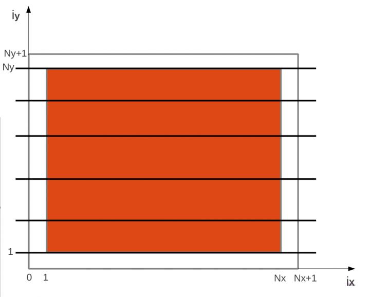
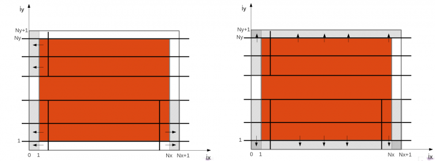
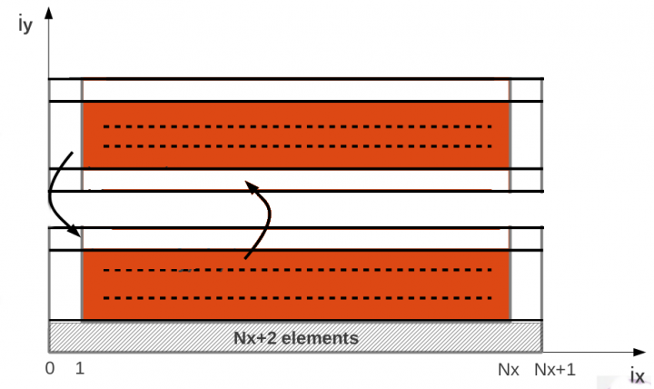

In this section we will go through the resolution of the previously stated exercise on code parallelization.

## 1) Domain decomposition

First let's go to the main function. Here we find the allocation for the temperature arrays. 
In the serial code the whole array is allocated in memory:

```
temp = (float *) malloc (nRow*nCol*sizeof(float));
temp_new = (float *) malloc (nRow*nCol*sizeof(float));
```
Now we need to transform these lines to let each task allocate only its chunk of data. Let's divide the domain by **rows**.



Please note that in the evolve function, each point needs all the 4 neighbours. 
Therefore, to cope with the points at the boundaries of the chunk, your need to allocate extra space for the so called ghost cells. 
This extra allocation is also valid for the first and the last task. Can you tell why?

We challenge you to take care also of the remainders in case NY is not divisible by the number of tasks.

## 2) Initialization

Now each task has its own chunk of data and each one must perform the initialization.

```
init_transport(temp);
```

Given the domain decomposition by rows, we need to modify accordingly the function that transforms
discrete coordinates (iy = 1,...,100) to real coordinates (y=-1.0,...,+1.0)

```
iy2y(iy){
     return ((iy-1) - (NY-1) / 2.0)*LY/(NY-1)
}
```

This means that the local iy discrete coordinate must be converted to the global iy discrete coordinate. 
Again, are you able to take care of the remainders?

## 3) Update boundaries
In each step of the simulation boundaries are updated. With the domain decomposition new boundaries are introduced.

Each task can take care of the left and right boundaries of the domain, while only the first and the last have 
to deal with the lower and the upper side of the domain. The following picture shows how the work must be divided 
among the tasks.



With the domain decomposition we have artificially removed the proximity of certain points in the domain. 
This imposes that data has to be shared among tasks resulting in task dependencies. Ghost cells must be updated 
each step of the simulation, receiving data from and sending data to the neighbour tasks. You might want to use 
MPI_PROC_NULL which is a special MPI value: communications that send to or receive form MPI_PROC_NULL have no effect.



## 4) Evolve simulation
You can now let each task evolve the simulation on its chunk of data. 
This function is pretty much the same of the serial code.

## 5) Save file
For simplicty only root (task 0) is devoted to write down the results. It will write its chunk of data, 
and after having received their own from the other tasks, it will complete the writing. 