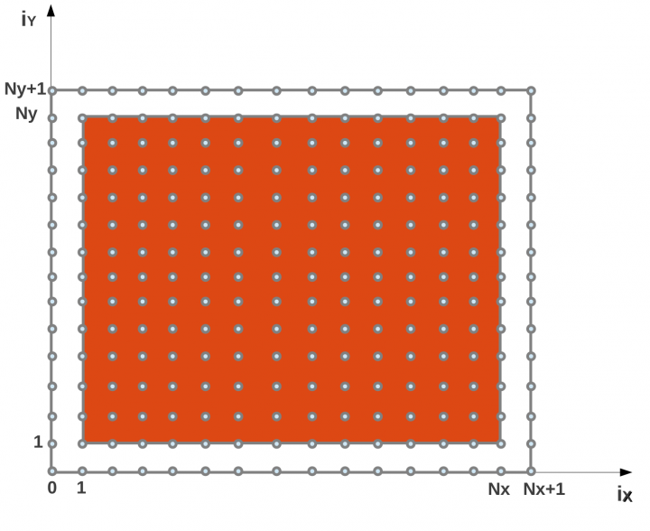
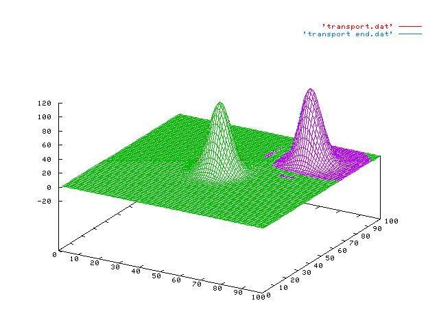
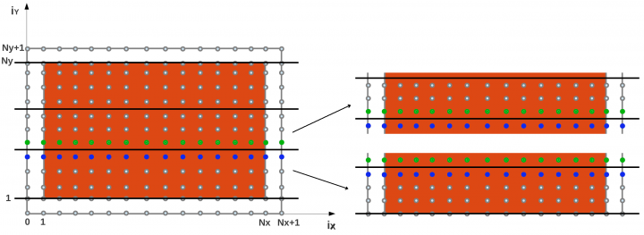

# Code parallelization and hybridization

### Transport problem

A serial code evolving the equation of motion:

*d/dx + d/dy = -d/dt*

is provided.

Temperature values are calculated over a grid and initialized with a gaussian distribution. 
The points of the grid represent the local indexes (ix, iy) of the matrix that contains the temperature values. 
The domain is shown in orange in the picture below. Boundaries are represented in white. Data are evolved along Y=X direction, 
i.e. towards the up-right corner of the coordinate system.



Compile the serial code, for example with the INTEL compiler (or the GNU compiler adding the argument "-lm" to the compilation 
line to avoid undefined reference to "exp" calls).

The execution of the code produces two files: 'transport.dat', the data set at time t=0, and 'transport_end.dat', the data after 
the transport dynamics. Data can be visualized with the command:

```
module load gnuplot
echo "set hidden3d; splot 'transport.dat' w l, 'transport_end.dat' w l" | gnuplot -persist
```
(note: to see graphs with gnuplot you have to ssh with the "-X" flag for display tunneling *ssh -X username@login...*)



### Exercise 1
Parallelize the code by using domain decomposition technique: **let's divide the domain in slices along the y coordinate**.



Keep in mind that the data is distributed by “leading dimension”:
FORTRAN: first coordinate
C: last coordinate

The important thing is that the data to send/recv are contiguous in memory. Otherwise a copy of them to/from a temporary 
contiguous buffer is needed

**Optional tasks** (easy for the serial version… try them in parallel too):
 - Evaluate the average over all the system and check it every 10 steps
 - Find the global maximum and print its position every 10 steps
 
#### HINTS:

|    | |
|----|----|
| **MPI_PROC_NULL** | communications to/from MPI_PROC_NULL do nothing|
| **iy2y** | this function has to deal with the domain decomposition along the y axis <br> iy2y(iy, <...>, <..>) |
| **comms** | FORTRAN: use a module to make variables like "nprocs, ... " available to the routines of the program |
| [**MPI_Get_count**](https://www.open-mpi.org/doc/v3.1/man3/MPI_Get_count.3.php) | Function/routine to get the number of elements sent in a message, given the status of the receive call |

### Exercise 2
- Add the OpenMP directives to the MPI code to parallelize some loops and to manage the MPI communications.
- Select and check the right MPI level of thread support.
- Print both the process and thread identifiers.
- Compile your code with the OpenMP support.
- Run with different configurations for processes and threads.

### Exercise 3 (optional)
Try to hybridize the solution of exercise 15 of the MPI tutorial, about the matrix transposal, by adding 
OpenMP directives. Remember to use "omp master" directive when a task should be performed by only one thread-per-task.