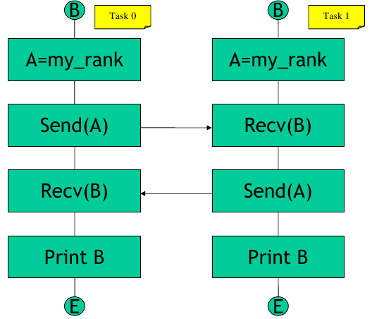
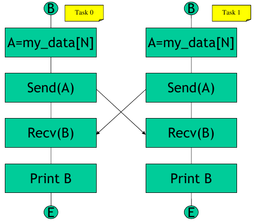

# Exercise 2

Write a code using point to point communication that makes two processes send each other an array of floats containing their rank. Each of the processes will declare two float arrays, A and B, of a fixed dimension (10000).  All of the elements of the array A will be initialized with the rank of the process. Then, A and B will be used as the buffers for SEND and RECEIVE, respectively. The program terminates with each process printing out one element of the array B. 

The program should follow this scheme:



The output should look like

```
 I am task 0 and I have received b(0) = 1.00 

 I am task 1 and I have received b(0) = 0.00 
```

**Optional**: Add a control that chacks if only two processes are running and exit if it is not the case.

## HINTS:

|    | **C** | **FORTRAN** |
|----|-------|-------------|
| [MPI_SEND](https://www.open-mpi.org/doc/v3.1/man3/MPI_Send.3.php) | int MPI_Send(void\* buf, int count, MPI_Datatype datatype, int dest, int tag, MPI_Comm comm) | MPI_SEND(BUF, COUNT, DATATYPE, DEST, TAG, COMM, IERROR) <br> \<type\> BUF(\*) INTEGER COUNT, DATATYPE, DEST, TAG, COMM, IERROR |
| [MPI_RECV](https://www.open-mpi.org/doc/v3.1/man3/MPI_Recv.3.php) | int MPI_Recv(void\* buf, int count, MPI_Datatype datatype, int source, int tag, MPI_Comm comm, MPI_Status \*status) | MPI_RECV(BUF, COUNT, DATATYPE, SOURCE, TAG, COMM, STATUS, IERROR) <br> \<type\> BUF(\*) <br> INTEGER COUNT, DATATYPE, SOURCE, TAG, COMM, STATUS(MPI_STATUS_SIZE), IERROR |
| [MPI_INIT](https://www.open-mpi.org/doc/v3.1/man3/MPI_Init.3.php) | int MPI_Init(int \*argc, char \***argv) | MPI_INIT(IERROR) <br> INTEGER IERROR |
| [MPI_COMM_SIZE](https://www.open-mpi.org/doc/v3.1/man3/MPI_Comm_size.3.php) | int MPI_Comm_size(MPI_Comm comm, int \*size) | MPI_COMM_SIZE(COMM, SIZE, IERROR) <br> INTEGER COMM, SIZE, IERROR |
| [MPI_COMM_RANK](https://www.open-mpi.org/doc/v3.1/man3/MPI_Comm_rank.3.php) | int MPI_Comm_rank(MPI_Comm comm, int \*rank) | MPI_COMM_RANK(COMM, RANK, IERROR) <br> INTEGER COMM, RANK, IERROR |
| [MPI_FINALIZE](https://www.open-mpi.org/doc/v3.1/man3/MPI_Finalize.3.php) | int MPI_Finalize(void) | MPI_FINALIZE(IERROR) <br> INTEGER IERROR |

# Q&A Exercise 2

**Q- What happens if the order of the send/receive in task 1 is inverted?**

A- Both processes try to send their buffer to the other process through blocking sends that do not return until the buffer is free from being used (i.e. a matching receive is posted or a system-dependent buffer is provided). Thus the execution of the following program



cannot go further the send calls and results in a deadlock.

**Q- Try to reduce the SEND buffer A to 1000 elements and invert the order of send/receive in task 1. What happens when  you run the code?**

A- This exploits the system-dependent buffer provided for the blocking send; even if the program should terminate in a deadlock the send calls are able to return thanks to that buffer (the send buffer has been transfered to the system buffer so the program can continue with the next instruction). 

**Q- Rewrite the code without any IF statement and any deadlock. What do you need to use instead of the blocking SEND?**

A- You can use the non blocking ISEND (see solution_02b.c or solution_02b.f90).
