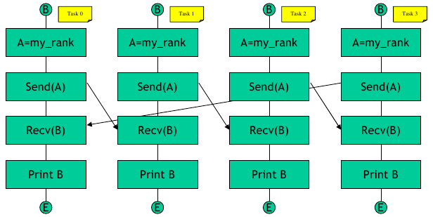

# Exercise 3

Write a code that using point to point communications performs a circular send/receive as represented in the following figure



Each task will declare two float arrays, A and B, of a fixed dimension (10000). Every element of A will be initialized with the rank of the process. Then, A and B will be used as the buffers for SEND and RECEIVE, respectively. Each process sends only to the process on its right and receives only from the process on its left. As you can see from the picture the last process will send its array A to the first task.

Avoid deadlocks and make sure that the code will work with a general number of tasks. Therefore, you need two variables to be used as destination and source for the send and receive calls, inizialized as:

```
            | my_rank + 1    every task except the last
    right = |
            | 0              last task

            | my_rank - 1    every task except the first
    left  = |
            | last rank      first task

```

The program terminates with each process printing out one element of the array B. 

```
 I am task 0 and I have received b(0) = 3.00 

 I am task 1 and I have received b(0) = 0.00 

 I am task 2 and I have received b(0) = 1.00 

 I am task 3 and I have received b(0) = 2.00
```

## HINTS:

|    | **C** | **FORTRAN** |
|----|-------|-------------|
| [MPI_ISEND](https://www.open-mpi.org/doc/v3.1/man3/MPI_Isend.3.php) | int MPI_Isend(void\* buf, int count, MPI_Datatype datatype, int dest, int tag, MPI_Comm comm, MPI_Request \*request) | MPI_ISEND(BUF, COUNT, DATATYPE, DEST, TAG, COMM, REQUEST, IERROR) <br> \<type\> BUF(\*) <br> INTEGER COUNT, DATATYPE, DEST, TAG, COMM, REQUEST, IERROR |
| [MPI_RECV](https://www.open-mpi.org/doc/v3.1/man3/MPI_Recv.3.php) | int MPI_Recv(void\* buf, int count, MPI_Datatype datatype, int source, int tag, MPI_Comm comm, MPI_Status \*status) | MPI_RECV(BUF, COUNT, DATATYPE, SOURCE, TAG, COMM, STATUS, IERROR) <br> \<type\> BUF(\*) <br> INTEGER COUNT, DATATYPE, SOURCE, TAG, COMM, STATUS(MPI_STATUS_SIZE), IERROR |
| [MPI_INIT](https://www.open-mpi.org/doc/v3.1/man3/MPI_Init.3.php) | int MPI_Init(int \*argc, char \***argv) | MPI_INIT(IERROR) <br> INTEGER IERROR |
| [MPI_COMM_SIZE](https://www.open-mpi.org/doc/v3.1/man3/MPI_Comm_size.3.php) | int MPI_Comm_size(MPI_Comm comm, int \*size) | MPI_COMM_SIZE(COMM, SIZE, IERROR) <br> INTEGER COMM, SIZE, IERROR |
| [MPI_COMM_RANK](https://www.open-mpi.org/doc/v3.1/man3/MPI_Comm_rank.3.php) | int MPI_Comm_rank(MPI_Comm comm, int \*rank) | MPI_COMM_RANK(COMM, RANK, IERROR) <br> INTEGER COMM, RANK, IERROR |
| [MPI_FINALIZE](https://www.open-mpi.org/doc/v3.1/man3/MPI_Finalize.3.php) | int MPI_Finalize(void) | MPI_FINALIZE(IERROR) <br> INTEGER IERROR |


# Q&A Exercise 3

**Q- Take a careful look at the output; is the task's order guaranteed? Try to run the code 3 times.**

A- The processes are independent and their termination order is basically not guaranteed.

**Q- What function call can you use instead of the pair ISEND/IRECV?**

A- A send-receive operation is very useful for executing a shift operation across a chain of processes: 

|    | **C** |  **FORTRAN** |
|----|-------|--------------|
| [MPI_SENDRECV](https://www.open-mpi.org/doc/v3.1/man3/MPI_Sendrecv.3.php) | int MPI_Sendrecv(void *sendbuf, int sendcount, MPI_Datatype sendtype, int dest, int sendtag, void *recvbuf, int recvcount, MPI_Datatype recvtype, int source, int recvtag, MPI_Comm comm, MPI_Status *status) | MPI_SENDRECV(SENDBUF, SENDCOUNT, SENDTYPE, DEST, SENDTAG, RECVBUF, RECVCOUNT, RECVTYPE, SOURCE, RECVTAG, COMM, STATUS, IERROR) <br> \<type\> SENDBUF(\*), RECVBUF(\*) <br> INTEGER SENDCOUNT, SENDTYPE, DEST, SENDTAG, RECVCOUNT, RECVTYPE, SOURCE, RECV TAG, COMM, STATUS(MPI_STATUS_SIZE), IERROR |

Try to modify the code in order to call the SENDRECV function instead of the SEND and RECV calls.
