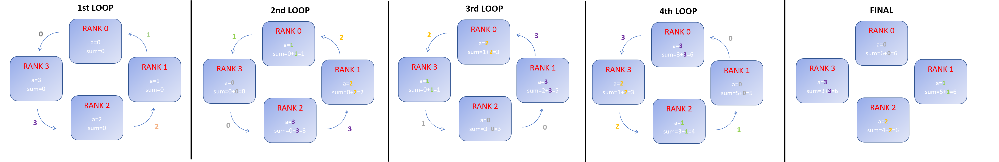

# Exercise 4

Write a code that performs a circular sum of the tasks' ranks. Let A be an integer initialized to the rank of the task, and B an integer used as a buffer for the receive call. Then, let SUM be a variable for storing the partial sum. The code should execute a series of send/receive calls, and, at each step:

- SUM is updated with the just received buffer B;
- the send buffer A is set to the just received buffer B.  

The following figure represents what the code should do (click on the image to enlarge it)



At the end of the execution, all the processes will have stored in their variable SUM the sum of all the ranks.

```     
    I am proc 0 and sum = 6 

    I am proc 1 and sum = 6 

    I am proc 2 and sum = 6

    I am proc 3 and sum = 6
```

## HINTS:

|    | **C** | **FORTRAN** |
|----|-------|-------------|
| [MPI_SENDRECV](https://www.open-mpi.org/doc/v3.1/man3/MPI_Sendrecv.3.php) | int MPI_Sendrecv(void *sendbuf, int sendcount, MPI_Datatype sendtype, int dest, int sendtag, void *recvbuf, int recvcount, MPI_Datatype recvtype, int source, int recvtag, MPI_Comm comm, MPI_Status *status) | MPI_SENDRECV(SENDBUF, SENDCOUNT, SENDTYPE, DEST, SENDTAG, RECVBUF, RECVCOUNT, RECVTYPE, SOURCE, RECVTAG, COMM, STATUS, IERROR) <br> \<type\> SENDBUF(\*), RECVBUF(\*) <br> INTEGER SENDCOUNT, SENDTYPE, DEST, SENDTAG, RECVCOUNT, RECVTYPE, SOURCE, RECV TAG, COMM, STATUS(MPI_STATUS_SIZE), IERROR |
| [MPI_INIT](https://www.open-mpi.org/doc/v3.1/man3/MPI_Init.3.php) | int MPI_Init(int \*argc, char \***argv) | MPI_INIT(IERROR) <br> INTEGER IERROR |
| [MPI_COMM_SIZE](https://www.open-mpi.org/doc/v3.1/man3/MPI_Comm_size.3.php) | int MPI_Comm_size(MPI_Comm comm, int \*size) | MPI_COMM_SIZE(COMM, SIZE, IERROR) <br> INTEGER COMM, SIZE, IERROR |
| [MPI_COMM_RANK](https://www.open-mpi.org/doc/v3.1/man3/MPI_Comm_rank.3.php) | int MPI_Comm_rank(MPI_Comm comm, int \*rank) | MPI_COMM_RANK(COMM, RANK, IERROR) <br> INTEGER COMM, RANK, IERROR |
| [MPI_FINALIZE](https://www.open-mpi.org/doc/v3.1/man3/MPI_Finalize.3.php) | int MPI_Finalize(void) | MPI_FINALIZE(IERROR) <br> INTEGER IERROR |
