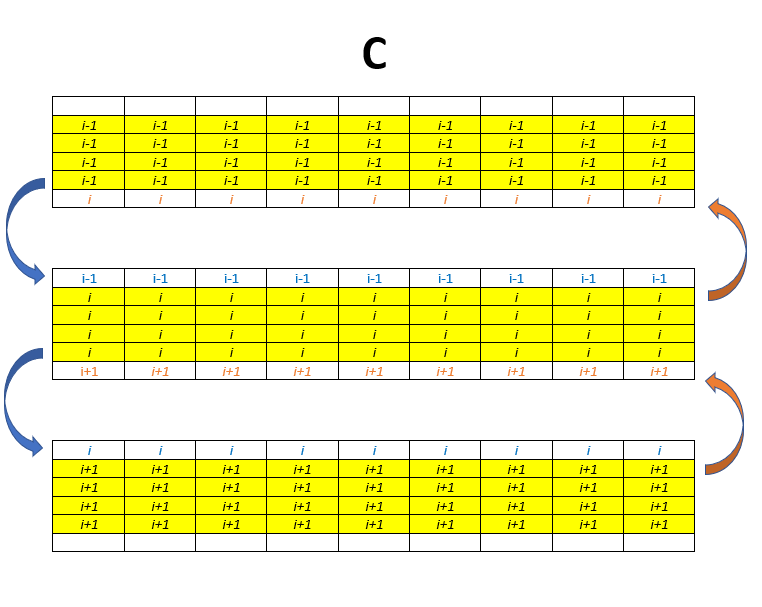
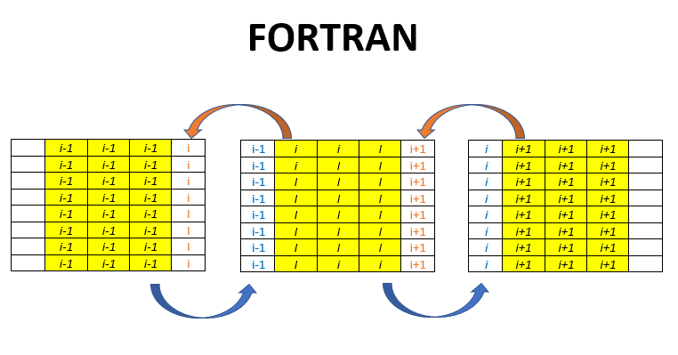

# Exercise 5

Distribute a global square NxN matrix (with N fixed) over P processors, so that each task has a local portion of it in its memory. Initialize such portion with the task's rank. 
NOTE: the exercise does not state that P has to be a divisor of N. How to deal with the matrix distribution if the number of rows/columns isn't the same for all tasks?

Each task sends its first and last columns (if Fortran) or rows (if C) to its neighbours (i.e.: the first column/row to the left processor, the last column/row to the right processor). Note that each task has to actually allocate a larger portion of its submatrix (ghost cells), with two extra columns/rows at the extremities to hold the received values. 

## HINTS:

|    | **C** | **FORTRAN** |
|----|-------|-------------|
| [MPI_SENDRECV](https://www.open-mpi.org/doc/v3.1/man3/MPI_Sendrecv.3.php) | int MPI_Sendrecv(void *sendbuf, int sendcount, MPI_Datatype sendtype, int dest, int sendtag, void *recvbuf, int recvcount, MPI_Datatype recvtype, int source, int recvtag, MPI_Comm comm, MPI_Status *status) | MPI_SENDRECV(SENDBUF, SENDCOUNT, SENDTYPE, DEST, SENDTAG, RECVBUF, RECVCOUNT, RECVTYPE, SOURCE, RECVTAG, COMM, STATUS, IERROR)   \<type\> SENDBUF(\*), RECVBUF(\*)   INTEGER SENDCOUNT, SENDTYPE, DEST, SENDTAG, RECVCOUNT, RECVTYPE, SOURCE, RECV TAG, COMM, STATUS(MPI_STATUS_SIZE), IERROR |
| [MPI_INIT](https://www.open-mpi.org/doc/v3.1/man3/MPI_Init.3.php) | int MPI_Init(int \*argc, char \***argv) | MPI_INIT(IERROR)   INTEGER IERROR |
| [MPI_COMM_SIZE](https://www.open-mpi.org/doc/v3.1/man3/MPI_Comm_size.3.php) | int MPI_Comm_size(MPI_Comm comm, int \*size) | MPI_COMM_SIZE(COMM, SIZE, IERROR)   INTEGER COMM, SIZE, IERROR |
| [MPI_COMM_RANK](https://www.open-mpi.org/doc/v3.1/man3/MPI_Comm_rank.3.php) | int MPI_Comm_rank(MPI_Comm comm, int \*rank) | MPI_COMM_RANK(COMM, RANK, IERROR)   INTEGER COMM, RANK, IERROR |
| [MPI_FINALIZE](https://www.open-mpi.org/doc/v3.1/man3/MPI_Finalize.3.php) | int MPI_Finalize(void) | MPI_FINALIZE(IERROR)   INTEGER IERROR |
