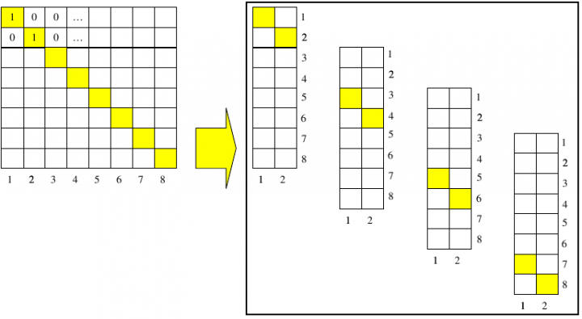

# Exercise 6

Write a program that performs a data distribution over the processes of the identity matrix, as pictured in the following figure:



Given the number of processes and the dimension of the identity matrix, each process must allocate its own portion of the matrix. Depending on the language of your choice, distribute the matrix by rows (C) or by columns (FORTRAN). 

First, obtain the number, N,  of rows (columns) you need to allocate for each process, np. In case N is not divisible by np, take care of the remainder with the module operator (function).     

Now you need to implement a transformation from global to local (task) coordinates. You can use a a varable, iglob, that shifts the values to be initialized to 1 according to the global coordinates:

| task | iglob (N = 8) | iglob (N = 10) |
|------|---------------|----------------|
| 0 | 1, 2 | 1, 2, 3 |
| 1 | 3, 4 | 4, 5, 6 |
| 2 | 5, 6 | 7, 8 |
| 3 | 7, 8 | 9, 10 |

To check if everything is correct make the process 0 collect all matrix blocks initialized by the other processes and print out the matrix:

```
1 0 0 0 0 0 0 0 0 0 
0 1 0 0 0 0 0 0 0 0 
0 0 1 0 0 0 0 0 0 0 
0 0 0 1 0 0 0 0 0 0 
0 0 0 0 1 0 0 0 0 0 
0 0 0 0 0 1 0 0 0 0 
0 0 0 0 0 0 1 0 0 0 
0 0 0 0 0 0 0 1 0 0 
0 0 0 0 0 0 0 0 1 0 
0 0 0 0 0 0 0 0 0 1 
```

## HINTS:

|    | **C** | **FORTRAN** |
|----|-------|-------------|
| [MPI_SEND](https://www.open-mpi.org/doc/v3.1/man3/MPI_Send.3.php) | int MPI_Send(void\* buf, int count, MPI_Datatype datatype, int dest, int tag, MPI_Comm comm) | MPI_SEND(BUF, COUNT, DATATYPE, DEST, TAG, COMM, IERROR) <br> \<type\> BUF(\*) INTEGER COUNT, DATATYPE, DEST, TAG, COMM, IERROR |
| [MPI_RECV](https://www.open-mpi.org/doc/v3.1/man3/MPI_Recv.3.php) | int MPI_Recv(void\* buf, int count, MPI_Datatype datatype, int source, int tag, MPI_Comm comm, MPI_Status \*status) | MPI_RECV(BUF, COUNT, DATATYPE, SOURCE, TAG, COMM, STATUS, IERROR) <br> \<type\> BUF(\*) <br> INTEGER COUNT, DATATYPE, SOURCE, TAG, COMM, STATUS(MPI_STATUS_SIZE), IERROR |
| [MPI_INIT](https://www.open-mpi.org/doc/v3.1/man3/MPI_Init.3.php) | int MPI_Init(int \*argc, char \***argv) | MPI_INIT(IERROR) <br> INTEGER IERROR |
| [MPI_COMM_SIZE](https://www.open-mpi.org/doc/v3.1/man3/MPI_Comm_size.3.php) | int MPI_Comm_size(MPI_Comm comm, int \*size) | MPI_COMM_SIZE(COMM, SIZE, IERROR) <br> INTEGER COMM, SIZE, IERROR |
| [MPI_COMM_RANK](https://www.open-mpi.org/doc/v3.1/man3/MPI_Comm_rank.3.php) | int MPI_Comm_rank(MPI_Comm comm, int \*rank) | MPI_COMM_RANK(COMM, RANK, IERROR) <br> INTEGER COMM, RANK, IERROR |
| [MPI_FINALIZE](https://www.open-mpi.org/doc/v3.1/man3/MPI_Finalize.3.php) | int MPI_Finalize(void) | MPI_FINALIZE(IERROR) <br> INTEGER IERROR |
