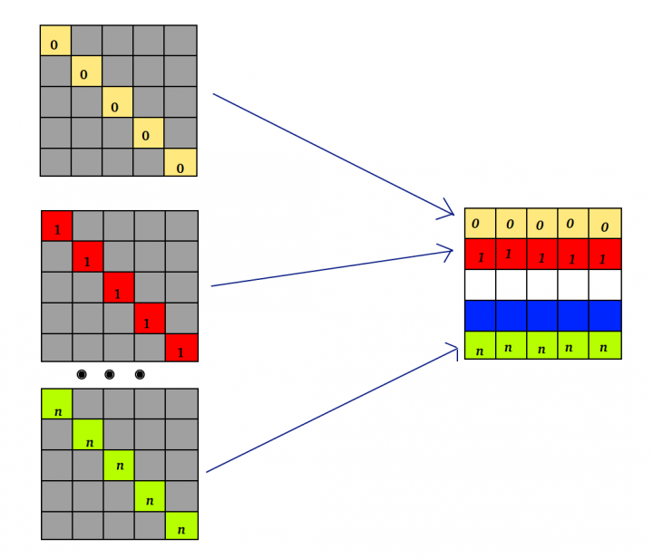

# Exercise 12

Each task initializes a square nxn matrix (n is the total number of the tasks) with 0s, except for the diagonal elements of the matrix that are initialized with the task's rank number.

Each task sends to rank 0 an array containing all the elements of its diagonal. Task 0 overwrites the array sent by process i on the i-th row (column if Fortran) of its local matrix. At the end, task 0 prints its final matrix, on which each element should be the number of its row (or column).

In order to send a diagonal, a proper vector datatype should be created and set for reading the diagonal elements of a matrix with the right displacement and stride. When you are communicating to rank 0, keep in mind that you are sending a single vector datatype, but you want to receive an array of n elements, that have to be stored contiguously in its matrix row (or column).

## HINTS:

|    | **C** | **FORTRAN** |
|----|-------|-------------|
| [MPI_TYPE_VECTOR](https://www.open-mpi.org/doc/v3.1/man3/MPI_Type_vector.3.php) | int MPI_Type_vector(int count, int blocklength, int stride, MPI_Datatype oldtype, MPI_Datatype \*newtype) | MPI_TYPE_VECTOR(COUNT, BLOCKLENGTH, STRIDE, OLDTYPE, NEWTYPE, IERROR)   INTEGER COUNT, BLOCKLENGTH, STRIDE, OLDTYPE, NEWTYPE, IERROR |
| [MPI_TYPE_COMMIT](https://www.open-mpi.org/doc/v3.1/man3/MPI_Type_commit.3.php) | int MPI_Type_commit(MPI_Datatype \*datatype) | MPI_TYPE_COMMIT(DATATYPE, IERROR)   INTEGER DATATYPE, IERROR |
| [MPI_TYPE_FREE](https://www.open-mpi.org/doc/v3.1/man3/MPI_Type_free.3.php) | int MPI_Type_free(MPI_Datatype \*datatype) | MPI_TYPE_FREE(DATATYPE, IERROR)   INTEGER DATATYPE, IERROR |
| [MPI_GATHER](https://www.open-mpi.org/doc/v3.1/man3/MPI_Gather.3.php) | int MPI_Gather(void\* sendbuf, int sendcount, MPI_Datatype sendtype, void\* recvbuf, int recvcount, MPI_Datatype recvtype, int root, MPI_Comm comm) | MPI_GATHER(SENDBUF, SENDCOUNT, SENDTYPE, RECVBUF, RECVCOUNT, RECVTYPE, ROOT, COMM, IERROR)   \<type\> SENDBUF(\*), RECVBUF(\*)   INTEGER SENDCOUNT, SENDTYPE, RECVCOUNT, RECVTYPE, ROOT, COMM, IERROR |
| [MPI_INIT](https://www.open-mpi.org/doc/v3.1/man3/MPI_Init.3.php) | int MPI_Init(int \*argc, char \***argv) | MPI_INIT(IERROR)   INTEGER IERROR |
| [MPI_COMM_SIZE](https://www.open-mpi.org/doc/v3.1/man3/MPI_Comm_size.3.php) | int MPI_Comm_size(MPI_Comm comm, int \*size) | MPI_COMM_SIZE(COMM, SIZE, IERROR)   INTEGER COMM, SIZE, IERROR |
| [MPI_COMM_RANK](https://www.open-mpi.org/doc/v3.1/man3/MPI_Comm_rank.3.php) | int MPI_Comm_rank(MPI_Comm comm, int \*rank) | MPI_COMM_RANK(COMM, RANK, IERROR)   INTEGER COMM, RANK, IERROR |
| [MPI_FINALIZE](https://www.open-mpi.org/doc/v3.1/man3/MPI_Finalize.3.php) | int MPI_Finalize(void) | MPI_FINALIZE(IERROR)   INTEGER IERROR |