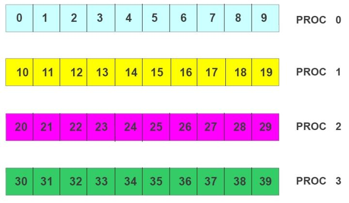

# Exercise 13

Write a code that writes and reads a binary file in parallel according to the following steps:


**1)** First process writes integers 0-9 from the beginning of the file, the second process writes integer 10-19 from the position 10 in the file and so on. Use the individual file pointers. 

**2)** Re-open the file. Each process reads the data just written by using an explicit offset. Check that the reading has been performed correctly. 

**3)** Each process writes the data just read in the following way (supposing that there are 4 processors) :

**Data per processor:** 



**File layout:**


**NOTE**: to see the binary file in ASCII use the command: 

 ```
 od -i <binary_file>
 ```
 
 ## HINTS:

|    | **C** | **FORTRAN** |
|----|-------|-------------|
| [MPI_FILE_OPEN](https://www.open-mpi.org/doc/v3.1/man3/MPI_File_open.3.php) | int MPI_File_open(MPI_Comm comm, char \*filename, int amode, MPI_Info info, MPI_File \*FH) | MPI_FILE_OPEN(COMM, FILENAME, AMODE, INFO, FH, IERROR) <br> CHARACTER\*(\*) FILENAME <br> INTEGER COMM, AMODE, INFO, FH, IERROR |
| [MPI_FILE_WRITE](https://www.open-mpi.org/doc/v3.1/man3/MPI_File_write.3.php) | int MPI_File_write(MPI_File fh, void \*buf, int count, MPI_Datatype datatype, MPI_Status \*status) | MPI_FILE_WRITE(FH, BUF, COUNT, DATATYPE, STATUS, IERROR) <br> <type> BUF(\*) <br> INTEGER FH, COUNT, DATATYPE, STATUS(MPI_STATUS_SIZE), IERROR |
| [MPI_FILE_SEEK](https://www.open-mpi.org/doc/v3.1/man3/MPI_File_seek.3.php) | int MPI_File_seek(MPI_File fh, MPI_Offset offset, int whence) | MPI_FILE_SEEK(FH, OFFSET, WHENCE, IERROR) <br> INTEGER(KIND=MPI_OFFSET_KIND) OFFSET <br> INTEGER FH, WHENCE, IERROR |
| [MPI_FILE_CLOSE](https://www.open-mpi.org/doc/v3.1/man3/MPI_File_close.3.php) | int MPI_File_close(MPI_File \*fh) | MPI_FILE_CLOSE(FH, IERROR) <br> INTEGER FH, IERROR |
| [MPI_FILE_GET_SIZE](https://www.open-mpi.org/doc/v3.1/man3/MPI_File_get_size.3.php) | int MPI_File_get_size(MPI_File fh, MPI_Offset \*size) | MPI_FILE_GET_SIZE(FH, SIZE, IERROR) <br> INTEGER(KIND=MPI_OFFSET_KIND) SIZE <br> INTEGER FH, IERROR |
| [MPI_FILE_READ_AT](https://www.open-mpi.org/doc/v3.1/man3/MPI_File_read_at.3.php) | MPI_File_read_at(MPI_File fh, MPI_Offset offset, void \*buf, int count, MPI_Datatype datatype, MPI_Status \*status) | MPI_FILE_READ_AT(FH, OFFSET, BUF, COUNT, DATATYPE, STATUS, IERROR) <br> <type> BUF(\*) <br> INTEGER(KIND=MPI_OFFSET_KIND) OFFSET <br> INTEGER FH, COUNT, DATATYPE, STATUS(MPI_STATUS_SIZE), IERROR |
| [MPI_TYPE_VECTOR](https://www.open-mpi.org/doc/v3.1/man3/MPI_Type_vector.3.php) | int MPI_Type_vector(int count, int blocklength, int stride, MPI_Datatype oldtype, MPI_Datatype \*newtype) | MPI_TYPE_VECTOR(COUNT, BLOCKLENGTH, STRIDE, OLDTYPE, NEWTYPE, IERROR) <br> INTEGER COUNT, BLOCKLENGTH, STRIDE, OLDTYPE, NEWTYPE, IERROR |
| [MPI_TYPE_COMMIT](https://www.open-mpi.org/doc/v3.1/man3/MPI_Type_commit.3.php) | int MPI_Type_commit(MPI_Datatype \*datatype) | MPI_TYPE_COMMIT(DATATYPE, IERROR) <br> INTEGER DATATYPE, IERROR |
| [MPI_TYPE_FREE](https://www.open-mpi.org/doc/v3.1/man3/MPI_Type_free.3.php) | int MPI_Type_free(MPI_Datatype \*datatype) | MPI_TYPE_FREE(DATATYPE, IERROR) <br> INTEGER DATATYPE, IERROR |
| [MPI_TYPE_SIZE](https://www.open-mpi.org/doc/v3.1/man3/MPI_Type_size.3.php) | int MPI_Type_size(MPI_Datatype \*datatype, int \*size) | MPI_TYPE_SIZE(DATATYPE, SIZE, IERROR) <br> INTEGER DATATYPE, SIZE, IERROR |
| [MPI_FILE_SET_VIEW](https://www.open-mpi.org/doc/v3.1/man3/MPI_File_set_view.3.php) | int MPI_File_set_view(MPI_File fh, MPI_Offset disp, MPI_Datatype etype, MPI_Datatype filetype, char \*datarep, MPI_Info info) | MPI_FILE_SET_VIEW(FH, DISP, ETYPE, FILETYPE, DATAREP, INFO, IERROR) <br> CHARACTER\*(\*) DATAREP <br> INTEGER(KIND=MPI_OFFSET_KIND) DISP <br> INTEGER FH, ETYPE, FILETYPE, INFO, IERROR |
| [MPI_FILE_WRITE_ALL](https://www.open-mpi.org/doc/v3.1/man3/MPI_File_write_all.3.php) | int MPI_File_write_all(MPI_File fh, void \*buf, int count, MPI_Datatype datatype, MPI_Status \*status) | MPI_FILE_WRITE_ALL(FH, BUF, COUNT, DATATYPE, STATUS, IERROR) <br> <type> BUF(\*) <br> INTEGER FH, COUNT, DATATYPE, STATUS(MPI_STATUS_SIZE), IERROR |
| [MPI_INIT](https://www.open-mpi.org/doc/v3.1/man3/MPI_Init.3.php) | int MPI_Init(int \*argc, char \***argv) | MPI_INIT(IERROR) <br> INTEGER IERROR |
| [MPI_COMM_SIZE](https://www.open-mpi.org/doc/v3.1/man3/MPI_Comm_size.3.php) | int MPI_Comm_size(MPI_Comm comm, int \*size) | MPI_COMM_SIZE(COMM, SIZE, IERROR) <br> INTEGER COMM, SIZE, IERROR |
| [MPI_COMM_RANK](https://www.open-mpi.org/doc/v3.1/man3/MPI_Comm_rank.3.php) | int MPI_Comm_rank(MPI_Comm comm, int \*rank) | MPI_COMM_RANK(COMM, RANK, IERROR) <br> INTEGER COMM, RANK, IERROR |
| [MPI_FINALIZE](https://www.open-mpi.org/doc/v3.1/man3/MPI_Finalize.3.php) | int MPI_Finalize(void) | MPI_FINALIZE(IERROR) <br> INTEGER IERROR |