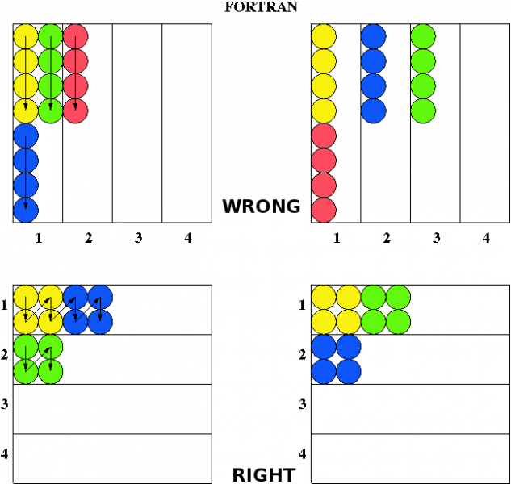

# Exercise 15

Write a program that performs the transpose of a square matrix A of arbitrary dimension (multiple of the number of tasks).

The matrix is split among the tasks and initialized so that each element is unique (use row-column number and task rank). 

Thus you need to evaluate B of the form:

B = A^T

Follows a visual representation of the matrices A and B (8x8 in the example):

 
 
Solve the problem distributing A and B by lines (or columns) over the tasks and using the collective communication MPI_ALLTOALL. Please note that this collective function works with data stored contiguously in memory, therefore choose carefully whether to store the matrix by lines or or columns (see Q\A below).

## HINTS:

|    | **C** | **FORTRAN** |
|----|-------|-------------|
| [MPI_ALLTOALL](https://www.open-mpi.org/doc/v3.1/man3/MPI_Alltoall.3.php) | int MPI_Alltoall(void\* sendbuf, int sendcount, MPI_Datatype sendtype, void\* recvbuf, int recvcount, MPI_Datatype recvtype, MPI_Comm comm) | MPI_ALLTOALL(SENDBUF, SENDCOUNT, SENDTYPE, RECVBUF, RECVCOUNT, RECVTYPE, COMM, IERROR)   <type> SENDBUF(\*), RECVBUF(\*)   INTEGER SENDCOUNT, SENDTYPE, RECVCOUNT, RECVTYPE, COMM, IERROR  |
| [MPI_INIT](https://www.open-mpi.org/doc/v3.1/man3/MPI_Init.3.php) | int MPI_Init(int \*argc, char \***argv) | MPI_INIT(IERROR)   INTEGER IERROR |
| [MPI_COMM_SIZE](https://www.open-mpi.org/doc/v3.1/man3/MPI_Comm_size.3.php) | int MPI_Comm_size(MPI_Comm comm, int \*size) | MPI_COMM_SIZE(COMM, SIZE, IERROR)   INTEGER COMM, SIZE, IERROR |
| [MPI_COMM_RANK](https://www.open-mpi.org/doc/v3.1/man3/MPI_Comm_rank.3.php) | int MPI_Comm_rank(MPI_Comm comm, int \*rank) | MPI_COMM_RANK(COMM, RANK, IERROR)   INTEGER COMM, RANK, IERROR |
| [MPI_FINALIZE](https://www.open-mpi.org/doc/v3.1/man3/MPI_Finalize.3.php) | int MPI_Finalize(void) | MPI_FINALIZE(IERROR)   INTEGER IERROR |
| [MPI_WTIME](https://www.open-mpi.org/doc/v3.1/man3/MPI_Wtime.3.php) | double MPI_Wtime(void) | MPI_WTIME() |
| [MPI_ABORT](https://www.open-mpi.org/doc/v3.1/man3/MPI_Abort.3.php) | int MPI_Abort(MPI_Comm comm) | MPI_ABORT(COMM, ERRCODE, IERROR)   INTEGER COMM, ERRCODE, IERROR|

# Q&A Exercise 15

**Q- Why choosing the distribution order (rows / columns) of the matrix is important?**

A- Let's consider the Fortran case with matrix stored over the processes first by colums then by rows. Note how MPI_ALLTOALL works: the jth block sent from process i is received by process j and is placed in the ith block of recvbuf. 

