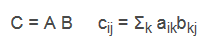
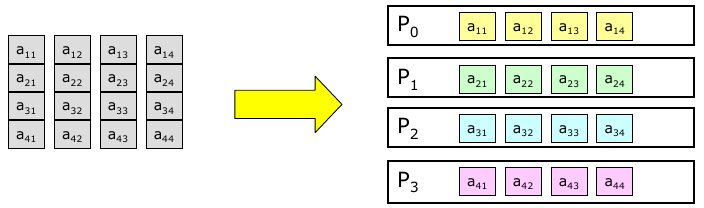
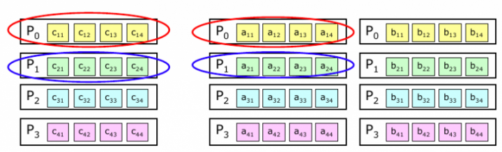
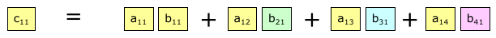
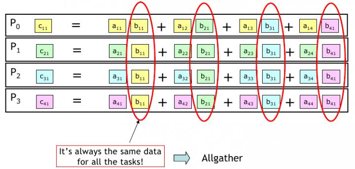
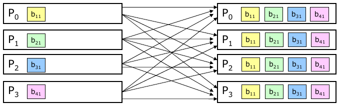
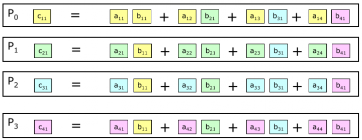

# Exercise 16

Write a subroutine implementing matrix multiplication and test it.
 

 
A, B and C being NxN matrices distributed by row among processes (at least 8x8). Inizialize A and B matrices respectively as aij = i*j and bij=1/(i*j). Try to minimize memory allocation and the number of MPI calls.
 


**Fortran case**: each process manages a row of elements (or blocks):



where each element of the matrix C is given by:



each process computes the first element (block) of its own row:



Therefore, for each column element (or block) of the matrix C you need to:

**1 - perform an MPI_ALLGATHER on the column**



**2 - calculate the column of the matrix C**



The output should resemble the following one:

 ```
A:
 1.0000  2.0000  3.0000  4.0000  5.0000  6.0000  7.0000  8.0000 
 2.0000  4.0000  6.0000  8.0000 10.0000 12.0000 14.0000 16.0000 
 3.0000  6.0000  9.0000 12.0000 15.0000 18.0000 21.0000 24.0000 
 4.0000  8.0000 12.0000 16.0000 20.0000 24.0000 28.0000 32.0000 
 5.0000 10.0000 15.0000 20.0000 25.0000 30.0000 35.0000 40.0000 
 6.0000 12.0000 18.0000 24.0000 30.0000 36.0000 42.0000 48.0000 
 7.0000 14.0000 21.0000 28.0000 35.0000 42.0000 49.0000 56.0000 
 8.0000 16.0000 24.0000 32.0000 40.0000 48.0000 56.0000 64.0000 
B:
 1.0000  0.5000  0.3333  0.2500  0.2000  0.1667  0.1429  0.1250 
 0.5000  0.2500  0.1667  0.1250  0.1000  0.0833  0.0714  0.0625 
 0.3333  0.1667  0.1111  0.0833  0.0667  0.0556  0.0476  0.0417 
 0.2500  0.1250  0.0833  0.0625  0.0500  0.0417  0.0357  0.0312 
 0.2000  0.1000  0.0667  0.0500  0.0400  0.0333  0.0286  0.0250 
 0.1667  0.0833  0.0556  0.0417  0.0333  0.0278  0.0238  0.0208 
 0.1429  0.0714  0.0476  0.0357  0.0286  0.0238  0.0204  0.0179 
 0.1250  0.0625  0.0417  0.0312  0.0250  0.0208  0.0179  0.0156 
C:
 8.0000  4.0000  2.6667  2.0000  1.6000  1.3333  1.1429  1.0000 
16.0000  8.0000  5.3333  4.0000  3.2000  2.6667  2.2857  2.0000 
24.0000 12.0000  8.0000  6.0000  4.8000  4.0000  3.4286  3.0000 
32.0000 16.0000 10.6667  8.0000  6.4000  5.3333  4.5714  4.0000 
40.0000 20.0000 13.3333 10.0000  8.0000  6.6667  5.7143  5.0000 
48.0000 24.0000 16.0000 12.0000  9.6000  8.0000  6.8571  6.0000 
56.0000 28.0000 18.6667 14.0000 11.2000  9.3333  8.0000  7.0000 
64.0000 32.0000 21.3333 16.0000 12.8000 10.6667  9.1429  8.0000 
 ```
 
## HINTS:

|    | **C** | **FORTRAN** |
|----|-------|-------------|
| [MPI_ALLGATHER](https://www.open-mpi.org/doc/v3.1/man3/MPI_Allgather.3.php) | int MPI_Allgather(void\* sendbuf, int sendcount, MPI_Datatype sendtype, void\* recvbuf, int recvcount, MPI_Datatype recvtype, MPI_Comm comm) | MPI_ALLGATHER(SENDBUF, SENDCOUNT, SENDTYPE, RECVBUF, RECVCOUNT, RECVTYPE, COMM, IERROR) <br> <type> SENDBUF(\*), RECVBUF(\*) <br> INTEGER SENDCOUNT, SENDTYPE, RECVCOUNT, RECVTYPE, COMM, IERROR |
| [MPI_INIT](https://www.open-mpi.org/doc/v3.1/man3/MPI_Init.3.php) | int MPI_Init(int \*argc, char \***argv) | MPI_INIT(IERROR) <br> INTEGER IERROR |
| [MPI_COMM_SIZE](https://www.open-mpi.org/doc/v3.1/man3/MPI_Comm_size.3.php) | int MPI_Comm_size(MPI_Comm comm, int \*size) | MPI_COMM_SIZE(COMM, SIZE, IERROR) <br> INTEGER COMM, SIZE, IERROR |
| [MPI_COMM_RANK](https://www.open-mpi.org/doc/v3.1/man3/MPI_Comm_rank.3.php) | int MPI_Comm_rank(MPI_Comm comm, int \*rank) | MPI_COMM_RANK(COMM, RANK, IERROR) <br> INTEGER COMM, RANK, IERROR |
| [MPI_FINALIZE](https://www.open-mpi.org/doc/v3.1/man3/MPI_Finalize.3.php) | int MPI_Finalize(void) | MPI_FINALIZE(IERROR) <br> INTEGER IERROR |