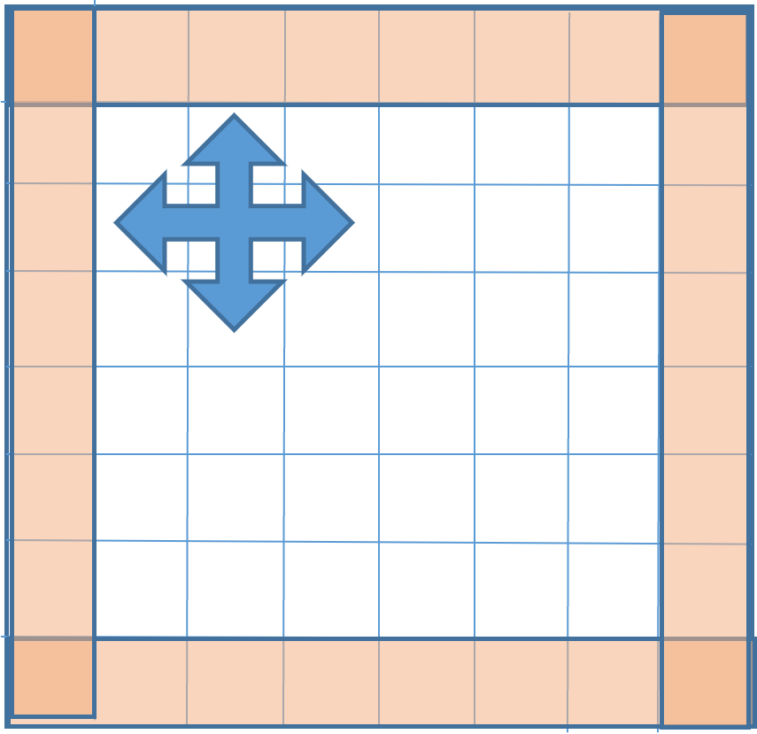
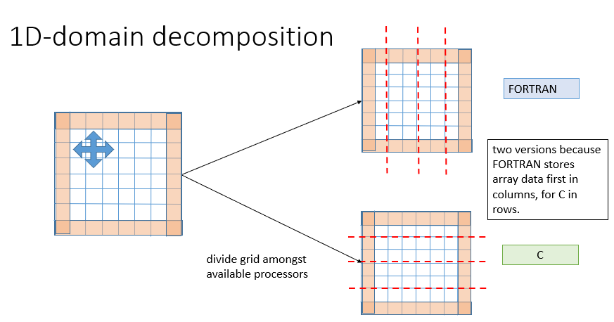
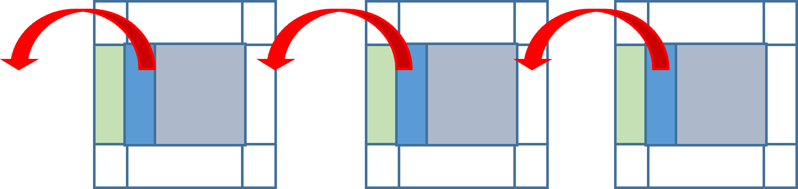
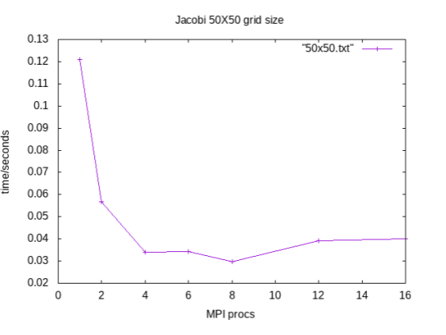

# Jacobi Stencil

## Introduction
The Jacobi method is an iterative algorithm for solving a system of linear equations. It can be used, for example, in the solving the heat equation for a particular geometry.

In the 2D model an approximation can be made by taking the average of the 4 neighbouring values of each point in a grid of points (i.e. a 4-point stencil):
```bash
Aij_new = 0.25*(A(i-1,j)+A(i+1,j)+A(i,j-1)+A(i,j+1))
```

The current grid is then replaced by the new grid and the cycle repeated. Convergence is achieved when the difference between the two grids is lower than some user defined threshold.

### Boundary conditions
The cells at the edges the grid can be updated according to *boundary conditions*, which can be periodic or fixed. Here we assume fixed boundary cells which are not altered during the update. in the figure below the orange cells are the boundary cells which are not updated, but their values are needed by the edge cells of the grid.



## Parallelism of the Jacobi algorithm with domain decomposition
The algorithm can be parallelised by MPI with the domain decomposition method which divides up the grid into domains, each of which is assigned to one MPI rank. The most efficient method for the 2D jacobi with an MxM grid, for example, would be to use a 2D decomposition with square domains. However, for simplicity we will use a 1D decomposition which divides the grid up into rows or columns:



Note that for FORTRAN, using columns is more efficient, while for C/C++ programs it is more efficient to used horizontal rows.

### Halo or ghost cells for data transfer
Each MPI rank needs data from neighbouring cells/ranks in order to complete its work.
To make this easier it is common to add *ghost* or *halo* cells to each domain, in order to store the data from neighbouring ranks. The communication of the neighbouring data is thus referred to as a *Halo exchange*. (see  below)



*In the above, the white cells are the ghost cells while the blue cells are the cells at the edge of the domain to copy to the neighbouring cell. The green halo cells will collect data in the following left-right halo exchange*

### Parallelisation algorithm
1. Divide up the main grid amongst the N MPI ranks, columns for FORTRAN programs, rows for C/C++.
2. Add extra memory to the local domains (i.e. for each rank) for receiving data from neighbouring domains (i.e. create halo cells)
3. For each rank:
 - send data from edge cells to the halo regions of neighbouring cells - this will be both left and right for FORTRAN, up and down for C/C++.
 - once the halo regions are filled, the jacobi update can be done 
 - calcuate the "norm" factor which will be used to decide if the program has finished. An `MPI_AllReduce` is performed to give each rank the correct norm factor.  
 - update the global grid with the new local grid
 -check for convergence

In the versions provided here, for simplicity, each rank holds a copy of the whole grid: in practice only one rank (usually rank 0) would store the grid.

## Exercises
We have provided, in both C and Fortran, serial and parallel jacobi programs.
The parallel programs have three variants:
- Halo updates with blocking send and receive
- Halo updates with non-blocking send and receive
- Halo updates with `MPI_SendRecv`

The exercise consists of :
1. Compile the serial and parallel programs (either C or FORTRAN)
2. Running the serial program, perhaps for multiple grid sizes (e.g. 50x50, 100x100, 200x200):
```bash
time ./jacobi-serial 100 100
```
In the serial versions we havent put timing commands, hence the use of the bash `time`.
3. Repeat with the MPI versions, using the SLURM  batch system to allocate resources.:
```bash
 srun -n4 ./jacobi-blocking 100 100
 ```
 and using different numbers of cores (ranks), for example 1,2,4,8,16 MPI ranks

4. Plot your results in a graph, like the one below


You may prefer to plot the *performance*, which in this case would be `1/walltime`.

#### Hint 
gnuplot is great for quickly plotting some data without downloading it from the cluster. Assuming you have the file with walltime as a function of MPI ranks this command will plot the performance, and a second line with expected linear speedup (You must have connected to the computer with the -X option of ssh)
```bash
module load gnuplot
gnuplot
gnuplot>t1=`head -1 data.txt | awk '{print $2}'`   # get first time point
gnuplot>set style data linesp
gnuplot>plot "data.txt" u 1:(1/$2) tit "Performance","data.txt" u 1:($1/t1) tit "Ideal"

```

## Questions

1. For each curve, at what point does the program achieve the maximum scaling?
2. How does this point vary with the grid size and why?
3. Compare the three MPI point-to-point commands: blocking, non-blocking and send-receive. Which communication gives the best performance?

## Comments
- The domain decomposition algorithm is so common that MPI provides a range of commands to help with the domain set up and halo exchanges and these are discussed in the latter part of the course. In addition, it is common to use MPI derived datatypes to simplify the send and receive MPI calls.

- **OpenMP Parallelisation**
Within each domain it is possible to apply OpenMP threading to speed up the calculations. This is a good parallelisation strategy: MPI for a *coarse-grain* parallelisation, perhaps with domains on separate nodes, then OpenMP for *fine-grain* parallelisation within the node/domain. MPI+OpenMP is often used in this way since, by reducing the number of MPI tasks, the memory can be reduced and possibly also increase parallel scalability.


